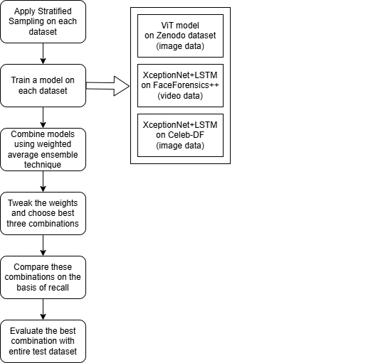
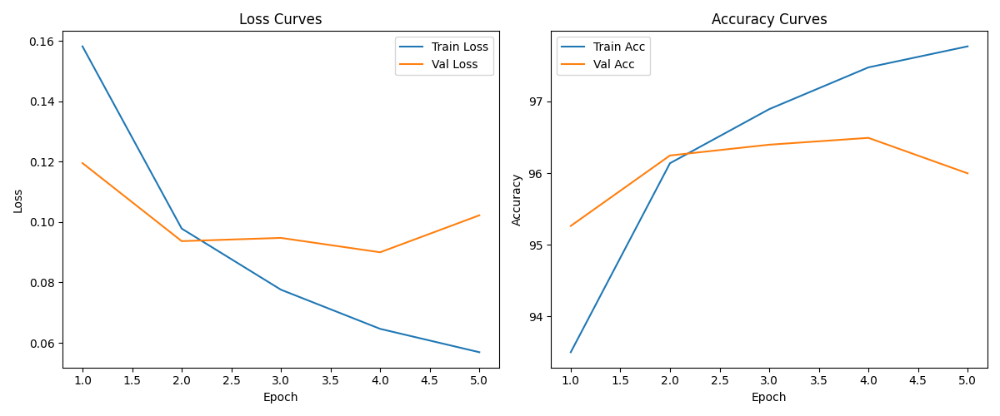
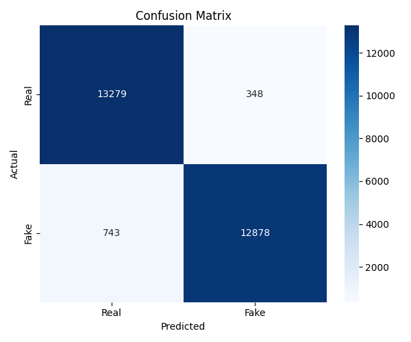
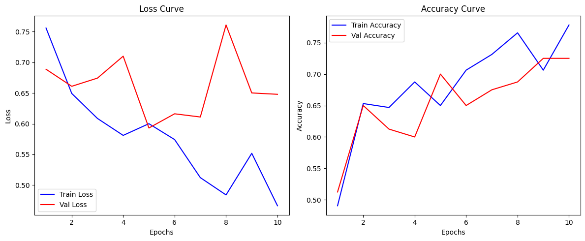
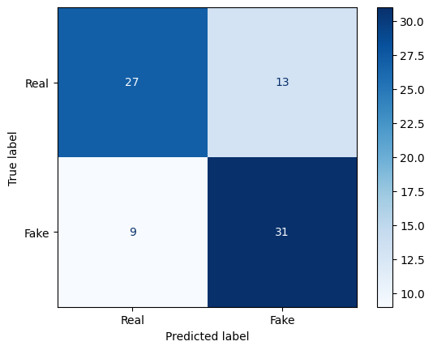
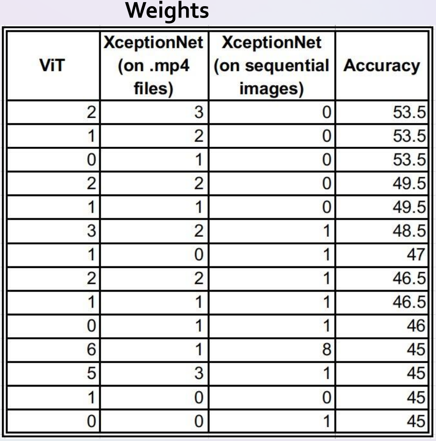
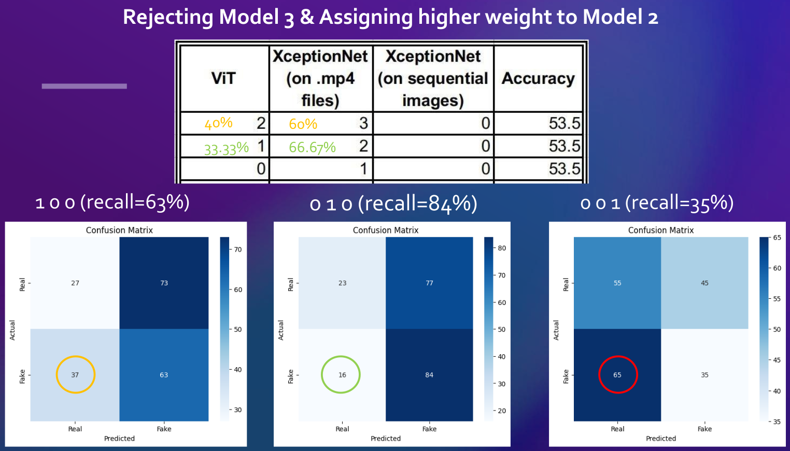
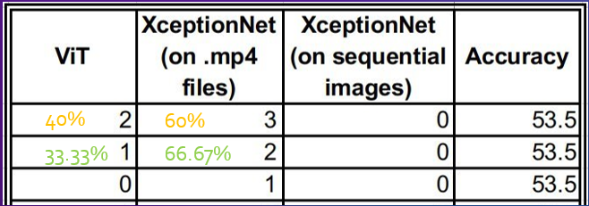
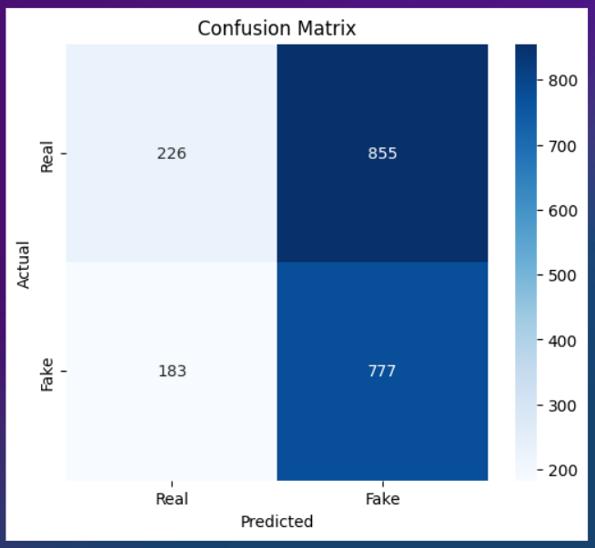

# DeepFake_Detection_Project
An ensemble model to detect DeepFakes in images and Videos

## Why Detecting Deepfakes Is Essential?

The rapid evolution of generative AI models—especially Generative Adversarial Networks (GANs)—has led to the creation of highly realistic synthetic media, commonly known as **deepfakes**. While this technology fuels innovation in entertainment, its malicious usage poses serious threats:

- **Misinformation & Disinformation:** Deepfakes have been weaponized in political, legal, and journalistic domains to manipulate public opinion.
- **Erosion of Trust:** They undermine trust in digital media by blurring the line between real and synthetic.
- **Bias & Stereotyping:** AI-generated media has been observed to reinforce harmful stereotypes, especially along gender and racial lines.
- **Security Risks:** Deepfakes can impersonate individuals in videos or audio to bypass authentication mechanisms.

---

## Existing Tools & Detection Methods

### 1. **DF Detect** ([go to tool](https://deepfake-detect.com/))
- Based on the EfficientNet architecture.
- Primarily designed for classifying GAN/StyleGAN-generated images.
- Achieves high accuracy (~96.36%) on benchmark datasets.

### 2. **Deepware Scanner** ([go to tool](https://scanner.deepware.ai/))
- Web-based tool for real-time video analysis.
- Offers frame-by-frame detection and probabilistic scores.
- Supports short, high-resolution video inputs.

---

## Limitations of Existing Methods

| Tool            | Limitation                                                                 |
|------------------|---------------------------------------------------------------------------|
| **DF Detect**     | Focused mainly on images, limited robustness across diverse fake types.   |
| **Deepware**      | Works only on videos ≤10 minutes, resolution-dependent, lacks interpretability. |

Most of these tools struggle with:
- Generalization across datasets with diverse manipulations.
- Achieving high recall (identifying all fake instances).
- Multimodal content (e.g., audio-video fusion).
- Explainability and confidence estimation.

---

## Proposed Method: Hybrid Deepfake Detection Pipeline

A **weighted ensemble model** combining spatial and temporal deep learning models for accurate and generalized detection of fake media is proposed.
The methodology can be outlined as follows:

### 1. **Dataset Preparation**

- **Training Datasets:**
  - **Zenodo**: 95k real & 95k fake face images. ([access dataset](https:/zenodo.org/records/5528418#.YpdlS2hBzDd))
  - **FaceForensics++**: 1,000 real videos, 1.8M+ manipulated frames using 4 fake generation methods. ([access dataset](https://www.kaggle.com/datasets/hungle3401/faceforensics))
  - **Celeb-DF**: 590 real & 5,639 fake videos from YouTube. ([access dataset](https://www.kaggle.com/datasets/nanduncs/1000-videos-split))
- **Test Dataset (Unseen):**
  - 140K real/fake faces from FFHQ and StyleGAN datasets. ([access dataset](https://www.kaggle.com/datasets/xhlulu/140k-real-and-fake-faces/data))

> All datasets were preprocessed and balanced using stratified sampling.

---

### 2. **Model Training**

Three models were trained individually:
([access trained models](https://www.kaggle.com/models/piyushswandile/deepfake-detection-models))

- **Model 1: Vision Transformer (ViT) on Zenodo Images**
  - Captures global visual inconsistencies.
  - Recall= 63%

- **Model 2: XceptionNet + GRU on FaceForensics++ Videos**
  - CNN for frame-level features + LSTM for temporal sequence modeling.
  - Recall= 84%

- **Model 3: XceptionNet + GRU on Celeb-DF Frames**
  - Relatively less accurate due to smaller dataset and noise.
  - Recall= 35%

---

### 3. **Ensemble Design**

**Trials with different weight combinations:**
Upon applying the weighted average ensemble prediction technique with various weight configurations, it was observed that the combinations (2,3,0), (1,2,0), and (0,1,0) yielded equivalent performance in terms of overall accuracy. Consequently, the selection of the optimal model configuration should further consider the individual performance characteristics of the constituent models.
In the context of deepfake detection, recall is deemed a more critical evaluation metric than overall accuracy. This preference arises because the misclassification of a real image as fake constitutes a tolerable error, whereas the misclassification of a fake image as real presents a significant risk and is thus unacceptable. Prioritizing recall ensures that the model minimizes the occurrence of such critical misclassifications.

To leverage strengths and suppress weaknesses:
- **Ensemble Method:** Weighted Average
- **Weights Assigned:** 66.7% to Model 2, 33.3% to Model 1
- **Rationale:** Higher weight to Model 2 for superior recall and Model 3 rejected due to very poor recall

Upon evaluating the models using recall as the primary metric, it was observed that the second model achieved the highest recall, recording a value of 84%. This indicates its superior capability in correctly identifying fake instances, which is critical in the context of deepfake detection where false negatives must be minimized. The first model, with a recall of 63%, also demonstrated reasonably good performance and was considered suitable for ensemble integration. In contrast, the third model exhibited a recall of only 35%, indicating a substantial deficiency in its ability to detect fake instances accurately. Given the low recall, inclusion of the third model could compromise the reliability of the final ensemble predictions. Therefore, only the first and second models were selected for the final ensemble architecture to optimize detection sensitivity and ensure higher robustness against deepfake content.

Among the available weight combinations that include both the first and second models, preference is given to the combination where the second model is assigned a comparatively higher weightage, approximately 66.67%. This decision is based on the superior recall performance demonstrated by the second model, which is critical for minimizing the risk of false negatives in deepfake detection. By allocating a greater influence on the second model in the ensemble, the final prediction architecture is better positioned to enhance detection sensitivity and improve overall system robustness.

---

### 4. **Final Evaluation**

- Tested on **2,041 completely unseen images**.
- **Final Recall:** 80.93%, optimizing for fake instance detection.
- High generalization and robustness validated via confusion matrix and performance curves.
- The model demonstrated strong generalization capability.

  

---

## Performance Comparison with Existing Tools

| Feature                        | **DF Detect**                      | **Deepware**                        | **Proposed Model**                          |
|-------------------------------|-----------------------------------|-------------------------------------|---------------------------------------------|
| Input Type                    | Images                             | Videos (≤10min, ≥1080p resolution)  | Images & Videos (no constraints)            |
| Architecture                  | EfficientNet                       | Custom proprietary                  | Ensemble: ViT + Xception + LSTM             |
| Explainability & Uncertainty | -                                 | -                                  | Planned in future with attention maps       |
| Resolution & Length Limits    | 128×128 (fixed)                    | ≥1080p, ≤10min                      | Supports original resolution, any length    |
| Tool Type                     | Image classifier                   | Web-based scanner                   | Research prototype, customizable pipeline   |

---

## Future Scope

- **Explainability**: Integrate Grad-CAM & attention rollout for visual explanations.
- **Uncertainty Estimation**: Use Bayesian layers or Monte Carlo dropout.
- **Adversarial Robustness**: Incorporate adversarial and generative augmentations.
- **Multi-modal Fusion**: Combine visual models with audio-based detectors like wav2vec for enhanced detection.

---

This project demonstrates the effectiveness of a robust ensemble model for deepfake detection, combining state-of-the-art techniques like XceptionNet, LSTM, GRU, and ViT to outperform existing tools such as DF Detect and Deepware Scanner. The proposed model achieved higher recall and precision, especially in terms of detecting subtle discrepancies in deep-fake videos, providing a more reliable and comprehensive solution. By incorporating multi-modal fusion, adversarial training, and robust evaluation, the model shows great potential for real-world applications in media authenticity verification and cybersecurity.

---
